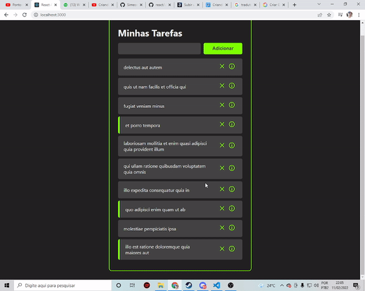
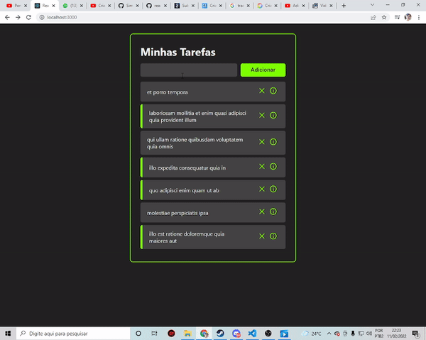

# Inicie esse projeto usando Create React App

Esse projeto foi iniciado com o [Create React App](https://github.com/facebook/create-react-app).

## Execulte este projeto usando:

### `npm start`

## Funcionalidades

* Cria uma lista tarefas ja prontas partindo do consumo de dados de uma api, com isso posso marca como completada, deletar ou ir para a aba de informações para ver a descrição da tarefa.

 
     </img>

* Crie suas próprias tarefas

 
     </img>

 

### <b> Versão 1.0 Finalizada</b> ✔️

 
